# React Practice Projects ⚛️

**[Live Demo](https://react-practice-projects-mini.vercel.app/)**

Welcome to my **React Practice Projects** repository! This is a collection of small, interactive React projects designed to help me (and hopefully others) learn and practice React concepts. Each project focuses on a specific feature or functionality, making it a great resource for beginners and intermediate developers alike.

## 🚀 Projects Overview

Here’s a list of all the projects included in this repository. Each project has a live demo link and a screenshot for quick reference.

---

### 1. **Counter App** - [Live Demo](https://react-practice-projects-mini.vercel.app/counter-app)

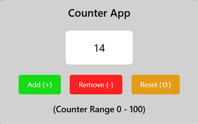

- **Features**: Increase, decrease, and reset a counter.

### 2. **Background Changer** - [Live Demo](https://react-practice-projects-mini.vercel.app/background-changer)

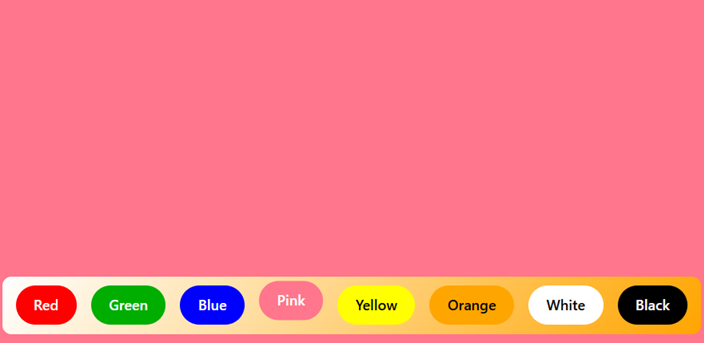

- **Features**: Change the background color with a button click.

### 3. **Random Password Generator** - [Live Demo](https://react-practice-projects-mini.vercel.app/random-password)

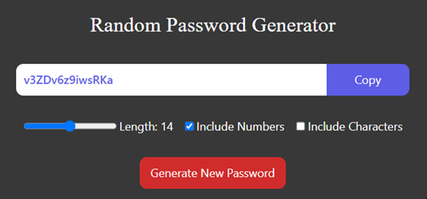

- **Features**: Generate random passwords with customizable length, include numbers and special characters.

### 4. **Currency Convertor** - [Live Demo](https://react-practice-projects-mini.vercel.app/currency-convertor)

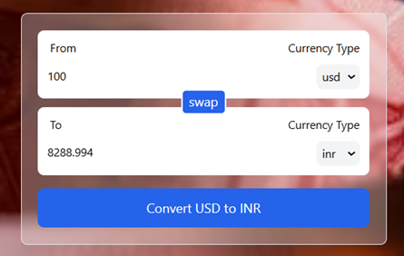

- **Features**: Convert currencies using real-time exchange rates & swap between currencies.

### 5. **Theme Changer** - [Live Demo](https://react-practice-projects-mini.vercel.app/theme-changer)

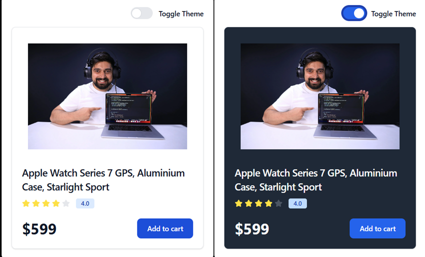

- **Features**: Toggle between light and dark themes.

### 6. **ToDo App** - [Live Demo](https://react-practice-projects-mini.vercel.app/todo-app)

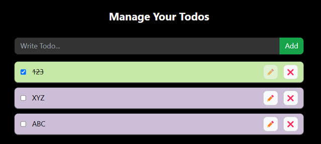

- **Features**: Add, delete, modify and mark tasks as complete.

### 7. **Accordion** - [Live Demo](https://react-practice-projects-mini.vercel.app/accordion)

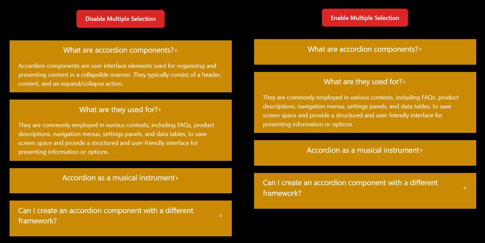

- **Features**: Expand and collapse sections of content.

### 8. **RGB & Hex Color Generator** - [Live Demo](https://react-practice-projects-mini.vercel.app/color-generator)

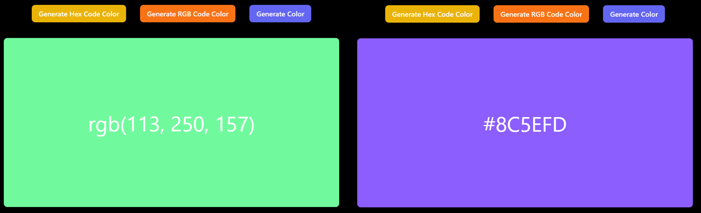

- **Features**: Generate random RGB and Hex color codes.

### 9. **Star Rating** - [Live Demo](https://react-practice-projects-mini.vercel.app/star-rating)

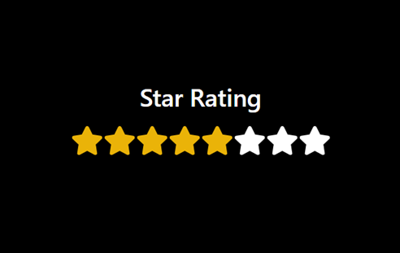

- **Features**: Rate items using a star-based system.

### 10. **Image Slider** - [Live Demo](https://react-practice-projects-mini.vercel.app/image-slider)

- **Features**: Navigate through a series of images.

### 11. **Infinite Loading** - [Live Demo](https://react-practice-projects-mini.vercel.app/load-more)

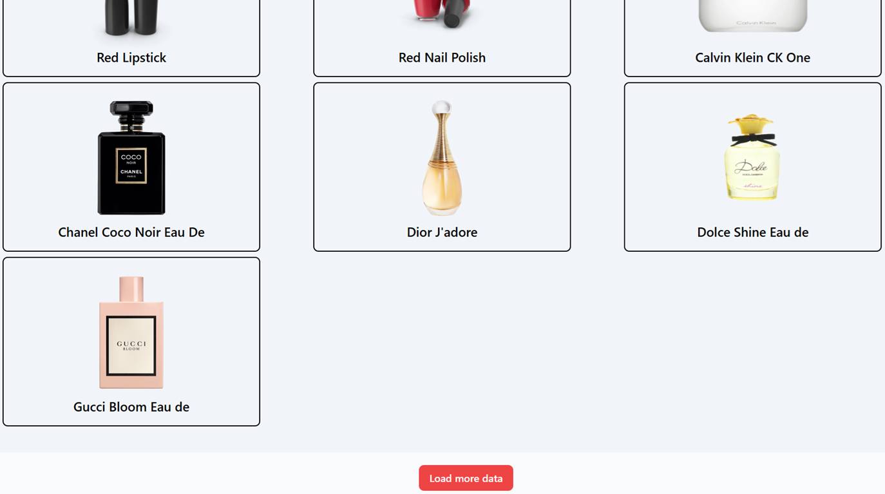

- **Features**: Load more data as the user scrolls.

### 12. **Tree View** - [Live Demo](https://react-practice-projects-mini.vercel.app/tree-view)

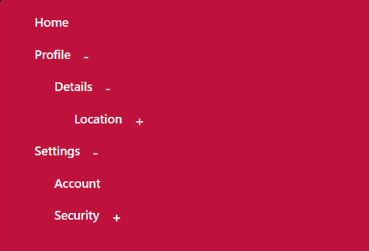

- **Features**: Display hierarchical data in a tree structure.

### 13. **QR Code Generator** - [Live Demo](https://react-practice-projects-mini.vercel.app/qr-code-generator)

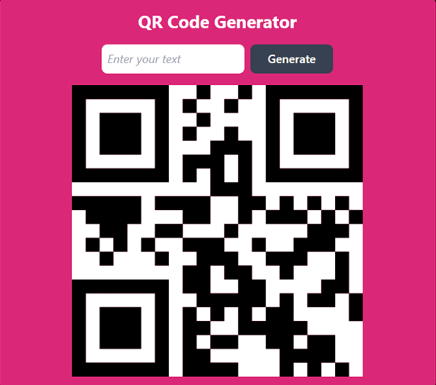

- **Features**: Generate QR codes from user input.

### 14. **Progress Bar** - [Live Demo](https://react-practice-projects-mini.vercel.app/progress-bar)

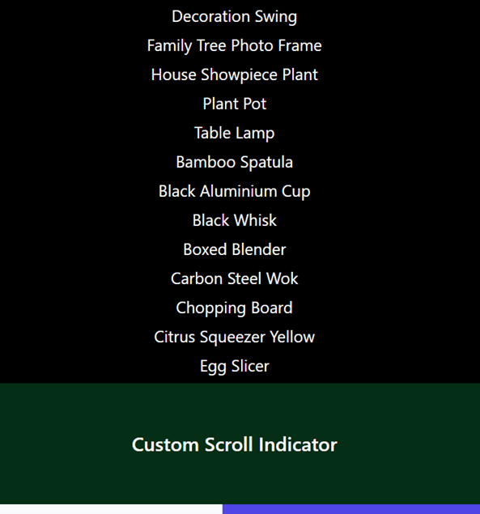

- **Features**: Display progress based on scroll position.

### 15. **Custom Tabs** - [Live Demo](https://react-practice-projects-mini.vercel.app/custom-tabs)

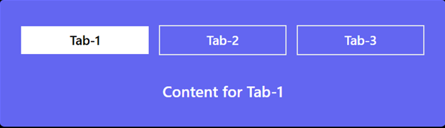

- **Features**: Switch between different content tabs.
